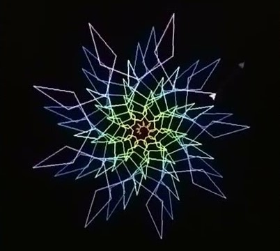

    # Trailblazers
    

## Table of Contents
- [Introduction](#introduction)
- [Development Status](#development-status)
- [Installation](#installation)
    - [Docker](#docker)
    - [Source](#source)
- [Contributing to Trailblazer](#contributing-to-trailblazer)
    - [Ways to Contribute](#ways-to-contribute)
    - [Getting Started](#getting-started)
    - [Contributing Code](#contributing-code)
    - [Reporting Bugs](#reporting-bugs)
    - [Documentation](#documentation)
    - [Testing](#testing)
    - [Review Process](#review-process)
- [Reporting Issues](#reporting-issues)
- [Acknowledgements](#acknowledgments)
- [License](#license)
- [Citation](#citation)

## Introduction
In the ever-changing landscape of computer science education, the Trailblazers programming team is thrilled to present our senior project proposal. A fusion of visual aesthetics and fundamental algorithmic concepts awaits as we introduce an interactive visual path racing website. This innovative venture not only captivates but also imparts profound knowledge of crucial path-finding algorithms, aiming to transform the learning experience for students.
